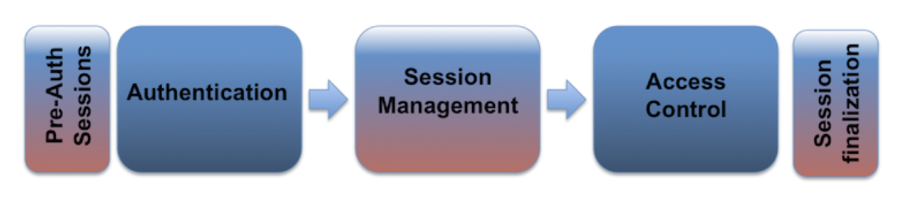
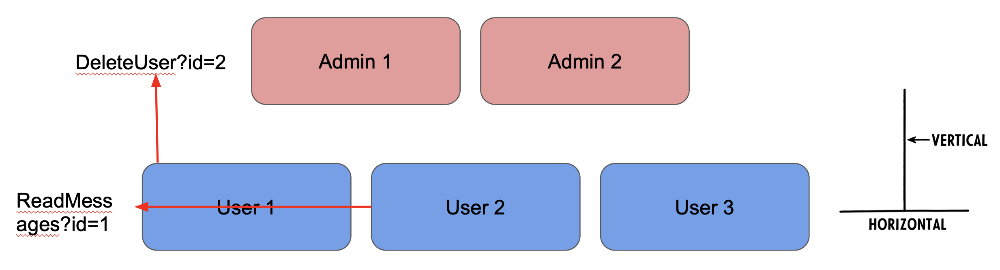

# Day 4 Notes - Security Testing

## OWASP Web Security Testing Guide
The WSTG is a comprehensive guide to testing the security of web applications and web services.
- [Security Testing Checklist](https://github.com/OWASP/wstg/blob/master/checklist/Testing_Checklist.md)

### WSTG-INFO	Information Gathering
- [Service discovering - nmap scanning](https://nmap.org/)
- [Fingerprint Web Application Framework](https://www.wappalyzer.com)

### WSTG-CONF	Configuration and Deploy Management Testing
- [Web files/directories enumeration](https://github.com/maurosoria/dirsearch)
- [Security Headers](https://securityheaders.com)
- [Cloud Storage](https://github.com/nccgroup/ScoutSuite)

### WSTG-CRYP	Cryptography
- [SSL checks](https://www.ssllabs.com/ssltest/)
- If you encrypt do it well
- Encrypt / Hash [Hashcat](https://hashcat.net/hashcat/)

### WSTG Identity Management, Authentication, Authorization, Session Management

### WSTG-ERRH	Error Handling

### WSTG-INPV	Input Validation Testing
- [Burp Suite](https://portswigger.net/burp)
- [Fuzzing with SecLists](https://github.com/danielmiessler/SecLists)
- [A list of useful payloads and bypass for Web Application Security and Pentest/CTF](https://github.com/swisskyrepo/PayloadsAllTheThings)
- [Command Injection](http://pygoat.herokuapp.com/cmd) `user/user12345`
- [Lab: File path traversal, simple case](https://portswigger.net/web-security/file-path-traversal/lab-simple)
- SSRF on OWASP Juice Shop `docker run --rm -p 3000:3000 bkimminich/juice-shop`

## Homework
- [OWASP Juice Shop: Probably the most modern and sophisticated insecure web application](https://github.com/juice-shop/juice-shop)
### Web Security Academy
- [Lab: Username enumeration via different responses](https://portswigger.net/web-security/authentication/password-based/lab-username-enumeration-via-different-responses)
- [Lab: Insecure direct object references](https://portswigger.net/web-security/access-control/lab-insecure-direct-object-references)
